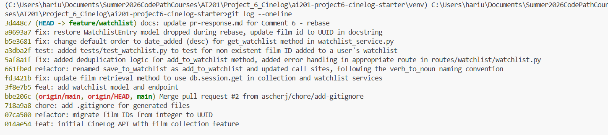

# PR Response Doc — CineLog Watchlist Feature

## AI Usage
**Codebase Reading**
- I used Claude to help explain certain functions, especially for files such as `models.py`, where the SQL-like objects were somewhat unfamiliar to me. Other files contains query methods which I gave to Claude as input to help understand what the query was searching on, and what the actual vs intended results where. I could then compare with with the docstrings to check if the behavior matches the intended functionality.

**Understanding Git Workflow**
- Since I am somewhat unfamiliar with using `git rebase`, I used Claude at various points to understand the process, and as a debugging tool when the WatchlistEntry model in `models.py` was overwritten. This helped me to prevent permanent edits that might cause unneeded conflicts or issues in the upstream/remote repository.

Note: I did not use AI tools to write my commments and design decisions, although I used Claude to help get an informed view of the codebase, which enabled me to properly defend and change design decisions.

## Comment 1 — Rename
**What I did:**
Renamed `save_to_watchlist` in watchlist_service.py to `add_to_watchlist`. Then, I updated all call sites (the `add_film` function in routes/watchlist/watchlist.py).

**How I verified:**
I ran the app and tried adding a film to a specific user's watchlist with a POST request to /watchlist/<user_id>/add, and then verified the watchlist with a GET request to /watchlist/<user_id>.

## Comment 2 — Deduplication
**What I did:**
I added the following  (lines 34-41) to the `add_to_watchlist` method:
```python
# prevent duplicate watchlist entries
    existing = WatchlistEntry.query.filter_by(
        user_id=user_id, film_id=film_id
    ).first()
    if existing:
        raise AlreadyInWatchlistError(
            f"Film '{film_id}' is already in this user's watchlist"
        )
```

I modeled the logic using the equivalent lines in the `add_to_collection` method. I also added a custom exception named `AlreadyInWatchlistError`, following the setup of `add_to_collection` and its use of the `AlreadyInCollectionError`.

I then added the following error handling in the route for routes/watchlist/watchlist.py, to make use of the newly added `AlreadyInWatchlistError`. The following lines were added/modified in the routes/watchlist/watchlist.py `add_film` method:
```python
try:
        entry = add_to_watchlist(user_id=user_id, film_id=data["film_id"])
        return jsonify(entry.to_dict()), 201
    except FilmNotFoundError as e:
        return jsonify({"error": str(e)}), 404
    except AlreadyInWatchlistError as e:
        return jsonify({"error": str(e)}), 409
```

**How I verified:**
I ran the app and tried adding a film to a specific user's watchlist with a POST request to /watchlist/<user_id>/add, and did this twice to confirm that an error was returned on the second try. This indicates that the deduplication logic worked. I also used a GET request to /watchlist/<user_id> before and after each POST request to ensure the state of the user's watchlist was correct.

## Comment 3 — Missing test
**What I did:**
I created and added the content in the file `tests/test_watchlist.py`.

The test in that file is named `test_add_to_watchlist_nonexistent_film_raises`, which is modeled after the similar test `test_add_to_collection_nonexistent_film_raises` located in the `tests/test_collection.py` file.

The added test is below:
```python
def test_add_to_watchlist_nonexistent_film_raises(app, sample_user):
    """
    Adding a film_id that doesn't exist in the database should raise
    FilmNotFoundError, not a database integrity error.
    """
    with app.app_context():
        fake_film_id = "00000000-0000-0000-0000-000000000000"

        with pytest.raises(FilmNotFoundError):
            add_to_watchlist(user_id=sample_user, film_id=fake_film_id)
```

**How I verified:**
I ran `pytest tests/test_watchlist.py -v` to ensure the added test passed. 
I then ran `pytest tests/ -v` to ensure the entire test suite still passed as expected.

## Comment 4 — Default visibility
**My position:**
Setting a default of `public=True` for WatchlistEntry objects makes it the default for a user's watchlist items to be public, unless set otherwise. This behavior is intentional since it allows for user engagement and visibility, promoting CineLog and creating a more involved community of users.

**Reasoning:**
Many movie logging sites such as Letterboxd contain watchlists and other lists curated by individual users for others to see. Having public watchlists allows other users to gain new recommendations, or follow their favorite users and friends on the platform to see what others are watching. Such public logging and listing activity makes CineLog feel more active, and users will feel that they have a stake in the app/community.

**Tradeoff acknowledged:**
The immediate flip-side is privacy concerns for users who want to use CineLog to privately manage their watchlists. In such cases, privacy-concerned users may not appreciate a default public visibility. For such users, an option should be provided to change their user-specific watchlist visibility to private.

## Comment 5 — Sort order
**My position:**
I agree with changing the default watchlist order by "date added" rather than alphabetically by the film's title.

**Reasoning:**
Most users will use watchlists as a reference later on when choosing movies to watch next. Recency is often an important factor in choosing a movie. Sorting by when the entry was added also allows the user to view the watchlist as a timeline of sorts. This makes navigation of the watchlist easier compared to an alphabetical ordering, since a user might not have a specific title in mind when going through the watchlist, making alphabetical search less useful.

**Engagement with reviewer's point:**
I agree with the reviewer's main point that "Most users want to see what they added recently". There might be other orderings that could make sense, such as the year the movie released, or grouped by genre. However, the date a movie was added to a watchlist will always be available in the database, and is often the default sorting for watchlists in apps such as YouTube.

## Comment 6 — Rebase
**What conflicted:**
Parts of the `.gitignore` conflicted, which stopped the rebase from continuing.

**How I resolved it:**
I edited the `.gitignore` file, accepting the incoming changes, and then ran `git add .gitignore`, followed by `git rebase --continue`. The remaining commits were applied successfully.

**How I verified no conflict remains:**
I double checked `git status`, and I also looked at the files to ensure that the Film integer to UUID change was applied in `models.py`. What I noticed is that the `WatchlistEntry` model was missing from `models.py`, and I used Claude to diagnose git command outputs, eventually realizing that the stale `models.py` completely omitted the `WatchlistEntry` model when rebasing, silently overwritting instead of raising a conflict.

To remedy this, I manually updated `models.py` and the docstring in `service/watchlist_service.py` as another commit.

## Git Log Online Screenshot


## PR Description
This PR seeks to incorporate the feature/watchlist branch, which developed an additional **Watchlist Feature** for CineLog.

The watchlist feature is similar to a user's collection, in that it allows users to add movies to a watchlist. The difference is that a collection is made up of movies the user has already watched, while a watchlist can be any list of movies.

The main additions are:
- `WatchlistEntry` model in `models.py`
- Route: `routes/watchlist/watchlist.py`
- Service Logic: `services/watchlist_service.py`

The related endpoints are:
- GET watchlist/<user_id> - Return the user's watchlist
- POST watchlist/<user_id>/add - Add a film with film_id to a user's watchlist

**Default Visibility**
The default visibility of watchlist entries is set to public. Setting a default of `public=True` for WatchlistEntry objects makes it the default for a user's watchlist items to be public, unless set otherwise. This behavior is intentional since it allows for user engagement and visibility, promoting CineLog and creating a more involved community of users.

**Default GET Order**
The watchlist results are sorted by the `WatchlistEntry` date_added, descending.

Most users will use watchlists as a reference later on when choosing movies to watch next. Recency is often an important factor in choosing a movie. Sorting by when the entry was added also allows the user to view the watchlist as a timeline of sorts. This makes navigation of the watchlist easier compared to an alphabetical ordering, since a user might not have a specific title in mind when going through the watchlist, making alphabetical search less useful.

**Testing**
- Run `python app.py`
- Run `pytest tests/` to run written unit tests
- Use curl commands or interfaces such as Postman to make GET and POST requests to the endpoints mentioned above


